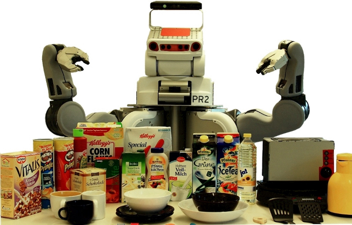

.. RoboSherlock documentation master file, created by
   sphinx-quickstart on Mon Dec  8 21:12:33 2014.
   You can adapt this file completely to your liking, but it should at least
   contain the root `toctree` directive.
   
Welcome To RoboSherlock
-----------------------

  

RoboSherlock is a common framework for cognitive perception, based on the principle of unstructured information management (`UIM`_\). UIM has proven itself to be a powerful paradigm for scaling intelligent information and question answering systems towards real-world complexity. Complexity in UIM is handled by identifying (or hypothesizing) pieces of structured information in unstructured documents, by applying ensembles of experts for annotating information pieces, and by testing and integrating these isolated annotations into a comprehensive interpretation of the document. This is enabled by a common type structure that defines the semantics behind the annotations and allows for seamless linking with knowledge-bases and intelligently selecting the necessary processing steps based on the observed data. RoboSherlock is implemented as a `ROS`_ node, is able to wrap almost any existing perception algorithm/framework, and allows easy and coherent combination of the results of these. Currently mostly functionalities from `OpenCV`_ and `PCL`_ are integrated. The framework is built to offer interfaces to our planning library (CRAM) and to KnowRob our centralized knowledge base. The core implementation of RoboSherlock is offered as an open-source project on github. Data produced during execution is continuously logged and can be accessed through our open knowledge-base, `openEASE`_.

.. _UIM: https://uima.apache.org
.. _ROS: http://www.ros.org/
.. _OpenCV: http://opencv.org/
.. _PCL: http://pointclouds.org/
.. _openEASE: http://www.open-ease.org/

.. toctree::
   :maxdepth: 0
   :hidden:
   
   overview
   install
   documentation
   tutorials
   publications
   about
