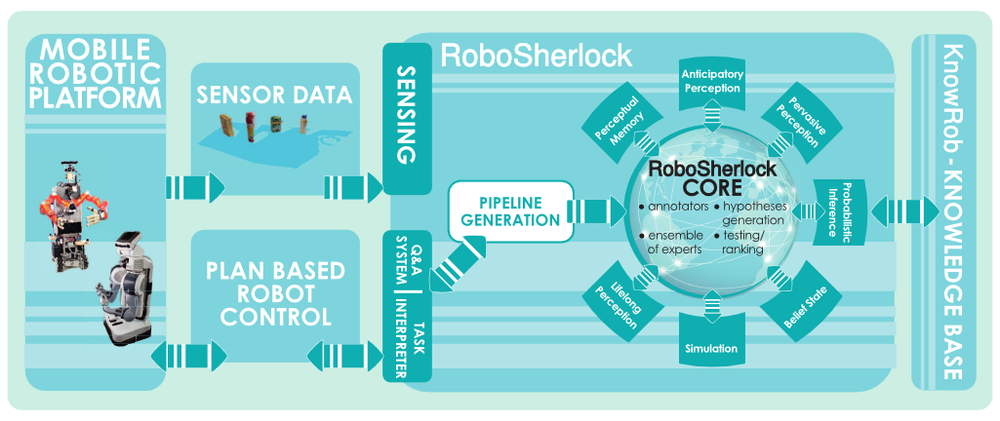

.. _overview_rs: 

========
Overview
========

In order to successfully use `RoboSherlock`, you need to be familiar with the basics of the **UIMA** framework. For an in depth view of what **UIMA** is check the online documentation_. `RoboSherlock` mostly uses the C++ implementation of the framework, which is limited in functionality, but offers the basic capabilities that are needed. A brief description of the most important concepts is presented below.

.. _documentation : https://uima.apache.org/documentation.html

UIMA
----

In **UIMA** (Unstructured Information Management Architecture) a processing pipeline is split in to several expert modules (called *Annotators*) that analyze the raw data and annotate parts of it with numeric or symbolic representations. Running several *Annotators* sequentially results in a rich description of the raw data, enabling reasoning about what the images represent (e.g. what are the regions in the image that could be objects, or a human, or a supporting plane etc.). Important concepts:

CAS
  The CAS, short for Common Analysis Structure, is the central data structure in **UIMA**. It works like a white-board architecture, at the time of creation it is empty and it gets filled with data during execution time. **IMPORTANT**: The CAS is created every time the pipeline starts and is deleted once every module in the pipeline has finished executing.

Type System
  The Type System is the 'common language' used by the modules in a pipeline. Everything that is added to a CAS needs to have a type defined. For a detailed presentation of the existing types check the :ref:`TypeSystem<type_system>` section. 

Analysis Engines
  Analysis Engines (**AEs**) are the core processing components in `RoboSherlock`. They can be either primitive or aggregate. In most cases a primitive AE is used to wrap an existing perception algorithm, read input data, produce outputs etc. Aggregate AEs are composed of multiple primitive AEs and in essence they define a perception pipeline. More details about existing AEs and how to write a new AE ...soon to come.

Useful Information about RoboSherlock
-------------------------------------

  
There are two important parts of the RoboSherlock project: the code base and the `.xml` definitions of the components.

Structure of the robosherlock package::

    ----
    |-config              -> configuration files for input (Kinect, Xtion, MongoDB)
    |-descriptors         
    |  |-analysis_engines -> xml definitions of aggregate AEs
    |  |-annotators       -> xml definitions of primitive AEs
    |  |-typesystem       -> xml definitions of the typesystem
    |-launch              -> ROS launch files
    |-scripts             -> various utility scripts
    |-src                 -> code base
    |package.xml          -> catkin package xml   
    |CMakeLists.txt       -> CMake file
    ----

RoboSherlock is meant to be used together with ROS, hence it offers interfaces to sensors only through their ROS drivers. Cameras that we have tested the software on are the **Xbox Kinect, Microsoft Kinect One and Asus Xtion** devices, which have a straight forward usage through their respective ROS packages.
