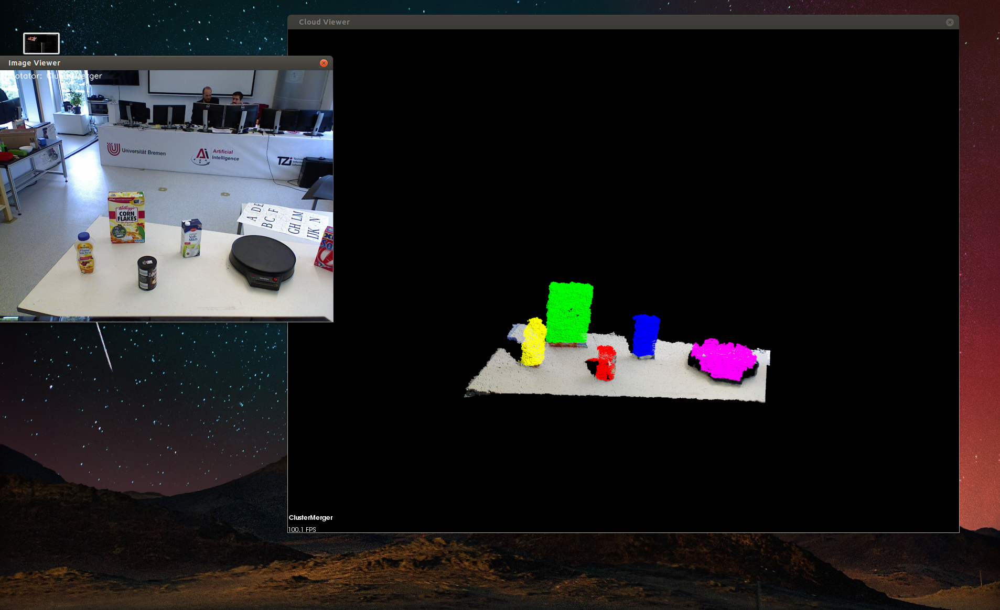

.. _pipeline:

==================================
Running a pipeline in RoboSherlock
==================================

The demo provided is very simple and is meant to introduce users to the components of the framework, and
how to use them. Download the provided :download:`sample bag file <./_static/test.bag>`. The bagfile was recorded using 
a PR2 robot and contains a short stream of kinect data, namely the topics: ::
  
    /kinect_head/rgb/image_color/compressed
    /kinect_head/depth_registered/comressedDepth
    /kinect_head/rgb/camera_info
    /tf

Tf is needed to get the transformation between camera frame and map or robot base. This feature can be turned off
in the camera configuration files.
    
Launch the robosherlock demo: ::   
    
    roslaunch robosherlock rs_demo.launch
    
The launch file will initialize active components of RoboSherlock and will wait for data to be published on the 
camera topics.
Start the bagfile: ::    
    
    rosbag play test.bag --loop
   
You should see the results of the individual annotators in the visualizer windows(one for the colored image and one 
for the generated point clouds). 
Pressing left or right will change the view. You should see an output similar to the one below:

The demo is a very simple example of how perception pipelines are defined and run in RoboSherlock. Launching 
the pipeline happens through running the *run* executable, which takes as parameter the name of 
the aggregate analysis engine, in this case demo. The definition of the pipeline is located in 
*./descriptors/analysis_engines/demo.xml*. The first part of the pipeline 
definition is **auto-generated during compilation**, and points to the meta definition of all components
that we are able to run using the current demo.xml. Lines 128-138 are the interesting bit, 
that define the actual pipeline, that will be executed sequentially.

The *demo.xml*

.. code-block:: xml
   :lineno-start: 128 

   <fixedFlow>
   <node>CollectionReader</node>
   <node>ImagePreprocessor</node>
   <node>PointCloudFilter</node>
   <node>NormalEstimator</node>
   <node>PlaneAnnotator</node>
   <node>ImageSegmentationAnnotator</node>
   <node>PointCloudClusterExtractor</node>
   <node>ClusterMerger</node>
   <node>ResultAdvertiser</node>
   </fixedFlow>

A detailed presentation of each component can be found on the ...

Try to add *<node>Cluster3DGeometryAnnotator<node>* before line 137 and relaunch RoboSherlock (no compilation required).
You will now have the estimated 3D bounding box with a pose estimate for each cluster (search the visual output for the results).

