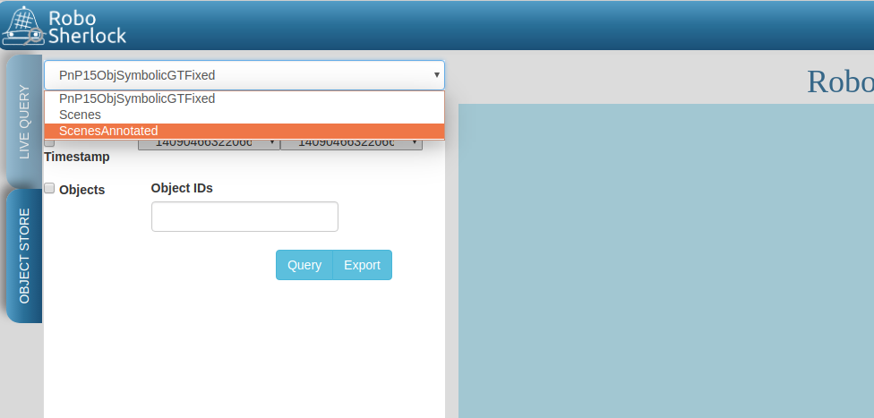
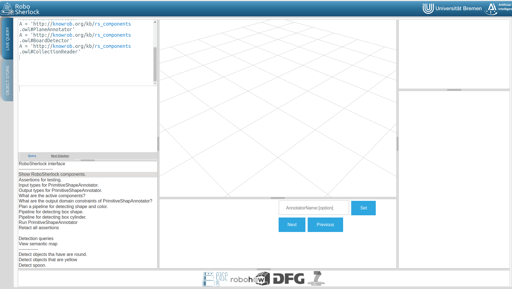
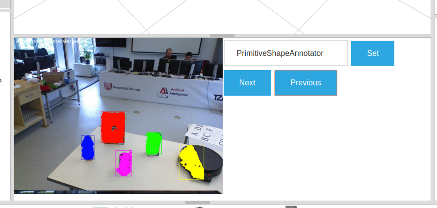

.. _ease_fall_school_2018:

============================================
RoboSherlock Tutorial: EASE Fall School 2018
============================================

This tutorial assumes some basic understanding of what ROS is and how to use its tools. The instructions here have been tested under Ubuntu 16.04, although, since you will be using using docker it should work on any OS.

-------------
Prerequisites
-------------

Throughout the tutorial we will be using a dockerized version of RoboSherlock. Docker is a virtualization tool, sort of like a virtual machine but not quite. For detail see the docker `homepage <https://docker.com>`_ or `wiki <https://en.wikipedia.org/wiki/Docker_(software)>`_

To install docker follow the instructions found here::

    https://docs.docker.com/install/linux/docker-ce/ubuntu

Once docker is installed you can got the Robosherlock image by opening a terminal and executing::

    docker pull robosherlock/rs_interactive
    
On the host machine create a folder that will be shared with the docker container::

    mkdir sandbox
    
To start the a container you will need to execute docker run with a couple of parameters (mainly for port forwarding so the ineractive web interface can work). Alternatively you can simply forward all ports (might conflict with existing mongodb though)::

    docker run -d -p 3000:3000 -p 8080:8080 -p 5555:5555 -p 9090:9090 -v ./sandbox:/home/rs/sandbox --name rs_demo robosherlock/rs_interactive
    
The ``-d`` option tells docker to run the container as a daemon, you will have to wait for a few seconds untill everything launches. Make sure to give the correct path to the ``sandbox`` folder on the host pc. To check that runnning the container was successfull open a browser (Firefox was tested to work, other browsers might have issues), and go to::

    localhost:3000

An xterm should open asking for a username and a password; Create a new file in the sandbox folder and create a file there::
    
    cd ~/sandbox && touch test_file

You should see the file appearing in the sandbox folder of the host machine. 

.. warning:: Changes made to a docker container persist only until the container exists; If you stop and remove the container changes you have made to it will be lost; To make changes permanent you need to commit them to the image; If you stop the container you can restart it using ``docker start rs_demo``.

The docker container contains a full installation of RoboShelrock, with all the dependencies and (almost) all of its current capabilities. To ease the use of the xterm in the browserbyobu (a screen variant) is installed, that allows openning multiple terminal windows, verticaland horizontal splitting etc. (Check the `cheat sheets <https://www.iconspng.com/images/byobu-cheat-sheet/byobu-cheat-sheet.jpg>`_ for more detail). The instructions that follow are all meant to be executed in the terminal window in a browser. When prompted for a new terminal window, open a new tab in byobu or split the existing one.

----------------------------
Introduction to RoboSherlock
----------------------------

RoboSherlock is a ROS package, and uses ROS to interface with other components of a robotic system. Before you begin let's set up a new ROS workspace. 

ROS workspace setup
-------------------

In your users home create a folder for the new workspace and initialize it as a catkin worksapce::
    
    mkdir -p demo_ws/src
    cd demo_ws
    catkin init 
    catkin config --extend /homer/rs/rs_ws/devel
   
The last command here ensures that you are chaining the workspaces together correctly. Build the empty workspace::
    
    catkin build

and source it::

   source /home/rs/demo_ws/devel/setup.bash

Make sure to add it to your ``bashrc`` so that terminals that you open in the future will know about it::

    echo 'source /home/rs/demo_ws/devel/setup.bash' >> ~/.bashrc

The basics of RoboSherlock
--------------------------

 * Task 1: create a ros package of your own (follow the tutorial from :ref:`create_your_rs_catkin_pkg`.

 * Task 2: run a simple pipeline: follow the tutorial: :ref:`pipeline`.
 
 * Task 3: how to write your own annotator: :ref:`create_your_own_ae`.
 
 * Task 4: log an execution: :ref:`mongodb`.

 
-------------------------------
Adapting capabilities to a task
-------------------------------

Now that you have seen how to run a pipeline, and how to modify it, let's see how can you create a system that is task dependent. We start with inspectin results and extracting data from the logs with the purpose of retraining detection components. 

Learning from logs
------------------

RoboSherlock offers a web-frontend for interaction. In a new terminal run::

  roslaunch rs_web app.py
  
In a browser navigate to ``localhost:5555``. Choose Objects Store tab and in the dropdown box select ScenesAnnotated as the active database, and click on Query:

..  :height: 30pc

Try chaning some of the filters for querying, and export the data. Notice that each object has very few annotations (size, pose, and geometry). Change the database to PnP15IvhSymbolicGTFixed. Start querying the database; Notice how this one has much much more information and even the objects tab returns results. Let's make our ``my_demo.yaml`` generate similar values. For this you should add a couple of extra annotators before the storage writer to the fixed flow, namely:

    * ``PrimitiveShapeAnnotator`` -> estimates the basic shape of an object from geometry
    * ``ClusterColorHistogramCalculator`` -> calculates a color histogram and adds a semantic color annotation
    * ``CaffeAnnotator`` -> use a pre-trained CNN as a feature extractor
    * ``PCLDescriptorExtractor`` -> extract 3D global feature descriptors
    * ``KnnAnnotator`` -> using previously extracted features classify a hypotheses
    * ``ObjectIdentityResolution`` -> track objects and solve entities. 

In ``my_demo.yaml`` set the parameter ``clearStorageOnStart`` parameter of ``StorageWriter`` to ``true``, forcing the system to drop existing collections from the database we want to write to every time we start robosherlock. Additionally set the ``loop`` option in ``config_mongodb_example.ini`` to false, so we stop at the end of execution. Run ``my_demo.yaml``::
    
     rosrun robosherlock run _ae:=my_demo

Use the webinterafece to inspect the results. Go to the objects tab, query it and use the export button to export the images. Now use these images as your new source data for training. For this do the following.

Fix the labels of the folders; On the host machine (use the ``sandbox`` folder so your docker will see the changes). The original KNN was trained on a different set of objects so the folder names are wrong. You can find the correct labels on the :ref:`data_rs` page. Rename the folders accordingly and arrange the images so they are separated into classes.

Extract CNN features for the objects. Create a split file in the sandbox folder. This is needed for the script extracing the features, call it ``my_split.yaml``::
    
    %YAML:1.0
    classes:
      - class_label1 (these names need to identical with the folder names)
      - class_label2

Now we can use a ``featureExtractor`` from ``rs_addons`` to exteact CNN features for each of our objects. In docker run::
  
    rosrun rs_addons featureExtractor -s /home/rs/sandbox/split.yaml -i /home/rs/sandbox/Objects/ -o /home/rs/sandbox
    
This will generate two files in the sandbox folder: ``BVLC_REF_ClassLabel_split.txt`` containin a class nr to class lable mapping and ``BVLC_REF_data_split.yaml`` containing the features extracted. 
Let's now set the ``KnnAnnotator`` to use these features to classify. In ``my_demo.yaml`` we will overwrite some of the parameters of KnnAnnotator:

.. code-block:: yaml
   :emphasize-lines: 15, 17-19
      
      ...
      CollectionReader:
	camera_config_files: ['config_mongodb_example.ini']
      StorageWriter:
	storagedb: 'ScenesAnnotated'
      KnnAnnotator:
        feature_descriptor_type: BVLC_REF
        class_label_mapping: /home/rs/sandbox/BVLC_REF_ClassLabel_split.txt
        trainin_data: /home/rs/sandbox/BVLC_REF_data_split.yaml

Now run ``my_demo`` again and inspect the restuls in the db using the web interface...You should see that the objects are correctly classified. Congrats, you just adapted the recognition capabilities of a robot based on it's episodic memoris...sort of :) In the following we will take a look at how all of this can be used to answer queries that a robotic agent might ask.

 
Knowledge integration and query answering
-----------------------------------------

The task of RoboSherlock is to complete the objects designators sent by the high-level executive; For this it offers a query interface. Queries get interpreted, a pipline is planned and executed.

If the web app from the preovious section is still running stop it. Launch knowrob and the web server together::

    roslaunch rs_run_configs json_prolog_and_rosbridge.launch 
    
This launches the json prolog interface to knowrob and all web frontend for interacting with RoboSherlock; You are going to be using the RS live tab of the web interface for this part of the tutorial. Fir the interactive visualization and query interface to work we need to start RoboSherlock using roslaunch. Copy one over from ``rs_run_configs`` and edit it so it launches ``my_demo.yaml``::

    roscd rs_tutorial
    mkdir launch
    cp $(rospack find rs_run_configs)/launch/wed_demo.launch./launch

Before launching robosherlock go to the ``Live query`` tab of the web frontend and start executing the predefined queries, up until the detection queries section.  

..    :height: 30pc
..    :width: 30pc

Once you retracted all assertions you can now launch robosherlock by running::

    roslaunch rs_tutorial web_demo.launch

Notice how on the last lines of RoboSherlocks outputs it is going to complain about MyFirstAnnotator not existing in the knowledge base. Don't worry about this for now. We wil fix it later on. 

Got to the web frontend and execute the detetion queries. In the middle bottom pane you can view the partial results of the annotators. Try combining the detection queries, change values etc.  

..    :height: 30pc

Let's first fix the annotator feature extraction. Add an input value constraint to ``KnnAnnotator``:

.. note:: In the current implementation input restrictions and output domains need to be set in the individual yamls of annotators. An extension is already on its way for allowing for this from the AAE yamls. 

.. code-block:: yaml
  
  capabilities:
    inputs: 
        - rs.scene.MergedCluster
        - rs.annotation.Features: ['BVLC_REF']

For KnnAnnotator to be included in the pipeline planning process we now need a component that produces an annotation of type ``rs.annotation.Features`` of type ``BVLC_REF``. Modify ``CaffeAnnotator.yaml`` to output rs.annotation.Features of type BVLC_REF. 

.. code-block:: yaml

    capabilties:
        outputs:
         - rs.annotation.Fetures: ['BVLC_REF']
         
Restart RoboSherlock and execute a new detection query. Notice that ``PCLDescriptorExtractor`` is no longer part of the planned pipeline.

 
Let's extend the tool-chain and add your package's annotations to the tool-chain. Create a second annotator called ``MySecondAnnotator``. Let's edit both of our annotators input and output requirements. 

As input requirements of ``MyFirstAnnotator`` let's add a shape annotation (``rs.annotation.Shape``) as cylinders, and as output a detection result (``rs.annotation.Detection``) with output domain Cups.

For ``MySecondAnnotator`` let's consider an algorithm that finds handles on cups. As input it will take classification annotations ``rs.annotation.Classification`` with input value constraint set to a specific cup (``CupEcoOrange``) and produces a detection of type Handle. Once modeled we need to update the ontoloy::

    roscd robosherlock_knowrob/owl
    rosrun robosherlock_knowrob generateOwlFromXMl.py

Restart json_prolog and RoboSherlock (in this order). Plan a pipeline for detection Cups. Now plan one for detecting Hanldes.
..TBC

    
