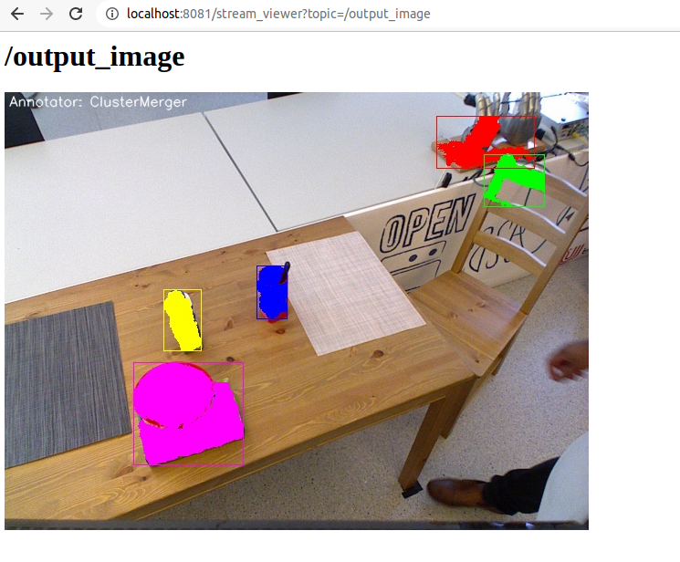
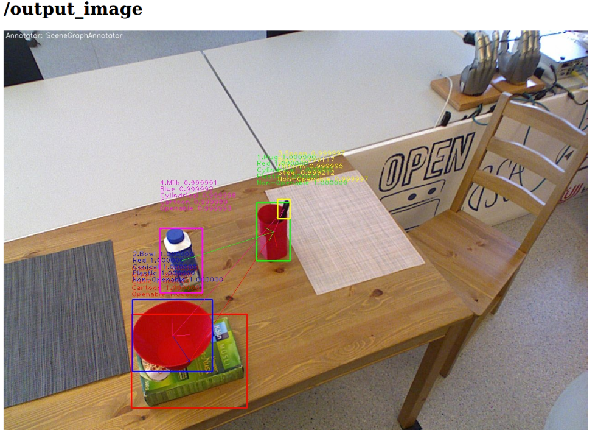

.. _ease_fall_school_assignements:

#######################################
RoboSherlock Tutorial: EASE Fall School
#######################################

*******************************
I. Introduction to RoboSherlock
*******************************

Befor you start update the docker image and make sure you have a container running::

    docker pull robosherlock/rs_interactive:fs2022

If you did not have the latest image and you already have a container running stop it and restart it.

Check for a running container::
  
    docker ps -a
    
If you need to restart it, execute the following::

    docker stop rs_demo
    docker rm rs_demo
    docker run -d -p 3000:3000 -p 8080:8080 -p 5555:5555 -p 9090:9090 -p 8081:8081 -p 9000:9000 -v ${HOME}/sandbox:/home/rs/sandbox --name rs_demo robosherlock/rs_interactive:fs2022

Open a terminal in your web browser::

    localhost:3000

RoboSherlock is a ROS package and uses ROS to interface with other components of a robotic system. Before you begin set up a new ROS workspace. 

I.1. ROS workspace setup
========================

In your users home create a folder for the new workspace and initialize it as a catkin worksapce::
    
    mkdir -p demo_ws/src
    cd demo_ws
    catkin init 
    catkin config --extend /home/rs/rs_ws/devel
   
The last command here ensures that you are chaining the workspaces together correctly. Build the empty workspace::
    
    catkin build

and source it::

   source /home/rs/demo_ws/devel/setup.bash

Make sure to add it to your ``bashrc`` so that terminals that you open in the future will know about it::

    echo 'source /home/rs/demo_ws/devel/setup.bash' >> ~/.bashrc

I.2. Create your own catkin-robosherlock package
================================================

Let's create a new package called ``rs_tutorial``. Make sure you are in the source folder of the newly created catkin workspace::

    cd ${HOME}/demo_ws/src
    rosrun robosherlock rs_create_package rs_tutorial

The script will create a new catkin package that has the structure needed for a packaged that depends on Robosherlock::

   'rs_tutorial'
    |-descriptors         
       |-analysis_engines -> yaml definitions of aggregate AEs
       |-annotators       -> yaml definitions of primitive AEs
       |-typesystem       -> yaml deginitions of the typesystem
          |-all_types.xml -> typesystem definition
    |-include
       |-rs_tutorial     -> include folder
          |-types         -> folder for the auto-generated type implementations
    |-src                 -> code base
    |-package.xml         -> catkin package xml   
    |-CMakeLists.txt      -> CMake file

The descriptor folder is there to hold all the configuration files of RoboSherlock components (annotators, analysis engines and the type system). Annotators are what wrap perception algorithms, analysis engines are composed of annotators and contain pipeline definitions and the type system defines a set of custom messages that enables the communication between components(sort of like ROS messages). We will look at these in detail later on. 

The script alse edits the *CMakeLists.txt*, sets the cmake variables needed for code generation. finding annotations automatically::

  ################################################################################
  ## Constants for project                                                      ##
  ################################################################################
  set(NAMESPACE package_name)
  set(TYPESYSTEM_CPP_PATH ${PROJECT_SOURCE_DIR}/include/package_name/types)
  set(TYPESYSTEM_XML_PATH ${PROJECT_SOURCE_DIR}/descriptors/typesystem)
  set(ANNOTATOR_PATH      ${PROJECT_SOURCE_DIR}/descriptors/annotators)
  set(ENGINE_PATH         ${PROJECT_SOURCE_DIR}/descriptors/analysis_engines)

  ################################################################################
  ## Update analysis engines, typesystem and include all relevant files         ##
  ################################################################################
  
  ## generate classes from the typesystem xml files
  generate_type_system(robosherlock)
  #find all relevant files
  find_additional_files()

The first part sets the five cmake variables that are in turned used by the scripts that are called in the second part. 
	
	* generate_type_system: checks if we have newly defined types in the xml descriptions and generates the C++ container classes for them
	
You can now add your custom annotators and analysis engines(AEs) that use any component defined in the RoboSherlock core package. If you want ``rs_tutorial`` to depend on other robosherlock packages add them to the ``package.xml`` and ``CMakeLists.txt``. We will do this in a later step. 

I.3. Running a pipeline(AE) in RoboSherlock
===========================================

Let's first look at the main components of the framework, and how to use them. The docker image comes with a simple example bag file. You will find it in ``~/data/`` folder.  The bagfile was recorded using a PR2 robot and contains a short stream of data form a Kinect sensor, namely the topics (check with ``rosbag info``): ::
  
    /kinect_head/rgb/image_color/compressed
    /kinect_head/depth_registered/comressedDepth
    /kinect_head/rgb/camera_info
    /tf

TF is needed to get the transformation between camera frame and map or robot base. This feature is optional, but having it can be of great help.

Perception pipelines in RoboSherlock are defined as aggregate analysis engines in the ``descriptor/analysis_engines`` folder of any robosherlock package. The core robosherlock package offers executables, that we can use to run any of these pipelines. To see how this work we have prepared an example launch file in the ``rs_ease_fs`` package called ``ease_fs_demo.yaml``. You can go to this package using the typical ROS commands::

    roscd rs_ease_fs

Inspect the contents of the yaml file and try to run the aggregate analysis engine. For this, start a *roscore* and in a second terminal launch the AAE execution (We recommend using *byobou* for multi terminal support, but you can also open another browser window:: 
    
    roscore
    roslaunch rs_ease_fs rs.launch
    
This will initialize the components defined in the descriptor and wait for data to be published on the camera topics. To process some images you will need to play the bagfile. Since it is only five seconds long loop it and slow it down::    
    
    rosbag play ${HOME}/data/example.bag -l -r 0.2
   
You can look at the results of the individual annotators using the browsed and visualizer page. Go to ``localhost:8081`` where you should see the following: 

    .. image:: /source/imgs/localhost_8081.png
      :align: center
      :height: 20pc
    ..    :width: 100pc

Choose *output_image* topic and the segmentation results should appear:

    .. image:: /source/imgs/rs_output_image.png
      :align: center
      :height: 20pc
    ..    :width: 100pc

In order to view the results of the individual annotators, that make up the pipeline, we have created two commands  for switching: ``rs_next`` and ``rs_prev``. Execute these commands in a terminal window and see the results in the visualization tab:

    .. image:: /source/imgs/rs_next.png
      :align: center
      :height: 20pc
    ..    :width: 100pc

Remember these commands since you will be needing them in the remainder of the tutorial. The demo is a very simple example of how perception pipelines are defined and one way of running them in RoboSherlock. The definition of the pipeline is located in *rs_ease_fs/descriptors/analysis_engines/ease_fs_demo.yaml*. Contents of it are the following:

.. code-block:: yaml
   
    ae: # -> various meta data	
        name: ease_fs_demo
    fixedflow: # -> the fixedflow a.k.a the perception algorithms, i/o components etc.
        - CollectionReader
        - ImagePreprocessor
        - RegionFilter
        - NormalEstimator
        - PlaneAnnotator
        - PointCloudClusterExtractor
        - ClusterMerger
    CollectionReader: # parameter overrides for annotators
        camera_config_files: ['config_kinect_robot_ease_fs.ini']

        
Modify this pipeline. For this, make a copy of it in ``rs_tutorial/descriptors/analysis_engines/``, and call it ``my_demo.yaml``::

    cp ~/rs_ws/src/rs_ease_fs/descriptors/analysis_engines/ease_fs_demo.yaml  ~/demo_ws/src/rs_tutorial/descriptors/analysis_engines/my_demo.yaml

Now edit ``my_demo.yaml`` and add a a new annotator to the pipeline, called *Cluster3DGeometryAnnotator*. Simply add a new entry to the list under the **fixedflow** tag.  Since the launch file you are starting simply executes whatever it finds under the ``fixedflow``, the order of algorithms is important. Add *Cluster3DGeometryAnnotator* after *ClusterMerger*. To run this new pipeline, you can specify a parameter for the launch file. The launch file can take several rosparams as input, one of them being the name of the aggregate analysis engine we want to execute (stop the previously started instance before doing this, otherwise some of the nodes the launch file starts will not be happy)::

     roslaunch rs_ease_fs rs.launch ae:=my_demo

.. note:: If you are seeing errors that the analysis engine is not found, make sure that your ROS workspace is up to data. Recompile the workspace and resource its setup.bash. You should be able to *roscd* to the  rs_tutorial package before trying to run ``my_demo``.

.. warning:: The YAML data format is sensitive to small mistakes. Indent using spaces and leave spaces after dases or colons. 
      
You will now have the estimated 3D bounding box with a pose estimate for each cluster as well as a heuristic-based symbolic label for the size of the object. Check the visualizer for results. You will see that the  *Cluster3DGeometryAnnotator* assigns labels to the object that represent the size of the objects (this is a hard-coded decision in the annotator based on the volume of the bounding box and is meant only as an example. It is evident that whether an object is considered small, medium or large is relative).

**Assignment** Add some more annotators: *PrimitiveShapeAnnotator*, *ClusterColorHistogramCalculator* and *DrawResultImage*. Visualizing their results using the web interface. The *ClusterColorHistogramCalculator* exposes a parameter that we need to overwrite in *my_demo.yaml*.  Simply add these two lines to the end of the file:

.. code-block:: yaml
   
    ClusterColorHistogramCalculator: # parameter overwriting 
        semantic_label: true

I.4. Write your own Annotator
=============================

Analysis engines (AEs) can be either primitive or aggregate. A primitive analysis engine (PAE) is also referred to as an annotator. In the following the creation of a new primitive analysis engine will be described, followed by creating an aggregate AE that uses is.

.. note:: It is not required that all primitive analysis engines annotate a scene, but for simplicity we call individual experts, that wrap perception algorithms, annotators. For example primitive AEs can generate object hypotheses, or have I/O tasks.

Annotators in RoboSherlock are written in C++. Besides the implementation, it is mandatory to have meta definitions of every component. A small script is available that makes creating new components faster. To create a new annotator, called ``MyFirstAnnotator`` in the package ``rs_tutorial``, run the following::
  
  rosrun robosherlock rs_new_annotator rs_tutorial MyFirstAnnotator

which will create a new annotator called *MyFirstAnnotator* in the previously created ROS-package *rs_tutorial*. It creates an yaml meta file in *descriptors/annotators* and a source file in *./src*. It also adds the necessary lines to your CMakeLists.txt::

  rs_add_library(rs_myFirstAnnotator src/MyFirstAnnotator.cpp)
  target_link_libraries(rs_myFirstAnnotator ${CATKIN_LIBRARIES})

Every component in RoboSherlock is a  C++ library, that gets loaded during runtime. The implementation consists of a cpp file and a yaml descriptor.

The yaml descriptor
-------------------

Confgiruations (meta definitions) of annotators are defined for every annotator in ``yaml`` files located in the ``<package_name>/descriptors/annotators`` folder. The annotator thatwe just created has the following configuration file:

.. code-block:: yaml
    
    annotator:
        name: MyFirstAnnotator
        implementation: rs_myFirstAnnotator
    parameters:
        test_param: 0.01
    capabilities:
        inputs: {}
        outputs: {}

The most important part of this configuration file is the implementation name. This is the name of a dynamic library that implements the annotator. All other parts of the configuration are optional, but this one is mandatory. 

Tha *parameters* section defines configuration parameters that the annotator has. These can be of type ``string, float, int, boolean`` or arrays of these. The last part can help define capabilities. This part is useful if we are using the pipeline planning and knowledge integration of the system, allowing users to set i/o constraints for annotators. You will edit this in part three of the tutorial. For now just leave it as it is.
	  
   
The cpp implementation
----------------------

`MyFirstAnnotator.cpp` was generated in the ``src`` folder, replace its contents with the following source code

.. code-block:: c++
    
      #include <uima/api.hpp>
      #include <pcl/point_types.h>
      #include <rs/types/all_types.h>
      //RS
      #include <rs/scene_cas.h>
      #include <rs/utils/time.h>
      #include <rs/DrawingAnnotator.h>
      using namespace uima;
      class MyFirstAnnotator : public DrawingAnnotator
      {
      private:
	float test_param;
	cv::Mat disp_;
      public:
	MyFirstAnnotator(): DrawingAnnotator(__func__)
	{
	}
	
	TyErrorId initialize(AnnotatorContext &ctx)
	{
	  outInfo("initialize");
	  ctx.extractValue("test_param", test_param);
	  return UIMA_ERR_NONE;
	}
	TyErrorId destroy()
	{
	  outInfo("destroy");
	  return UIMA_ERR_NONE;
	}
	TyErrorId processWithLock(CAS &tcas, ResultSpecification const &res_spec)
	{
	  outInfo("process start");
	  rs::StopWatch clock;
	  rs::SceneCas cas(tcas);
	  
	  cas.get(VIEW_COLOR_IMAGE, disp_);   
	  rs::Scene scene = cas.getScene();
	  std::vector<rs::ObjectHypothesis> hyps;
	  scene.identifiables.filter(hyps);
	  outInfo("Found "<<hyps.size()<<" object hypotheses");    
	  for (auto h:hyps)
	  {
	    std::vector<rs::Shape> shapes;
	    std::vector<rs::SemanticColor> colors;
	    h.annotations.filter(shapes);
	    h.annotations.filter(colors);
	  
	    bool shapeMatch=false, colorMatch=false;
	    for (auto shape:shapes)
		if(shape.shape() == "flat")
		      shapeMatch = true;
	    for(auto color:colors)
		if(color.color() == "black")
		      colorMatch = true;

	    if(shapeMatch && colorMatch)
	    {
	      outInfo("We have found a flat black object");
	      cv::Rect rect;
	      rs::conversion::from(h.rois().roi(), rect);
	      cv::rectangle(disp_,rect,cv::Scalar(0,0,255));
	      rs::Detection detection = rs::create<rs::Detection>(tcas);
	      detection.source.set("MyFirstAnnotator");
	      detection.name.set("SeverinPancakeMaker");
	      detection.confidence.set(1.0);
	      h.annotations.append(detection);
	    }
	  } 
	  return UIMA_ERR_NONE;
	}
	void drawImageWithLock(cv::Mat &disp)
	{
	disp = disp_.clone();
	}
      };

      // This macro exports an entry point that is used to create the annotator.
      MAKE_AE(MyFirstAnnotator)

Implementation of an annotator extends the ``DrwaingAnnotator`` class of the library which is a child of ``Annotator`` class defined in the UIMACPP library. ``Annotator`` has several virtual methods defined, out of which we are overriding the ``initialize``, ``destroy`` and ``process`` functions. Since annotators get compiled into runtime libraries they must end with the ``MAKE_AE(<AnnotName>)`` macro, that exports the entry point.

The three methods that we overwrite implement the functionalities of the annotator:

	- ``initialize`` : gets called in the constructor of the class. Has the same functionalities as a constructor. We can read in the parameters defined in the descriptor here (in the tutorial code this is *test_param*).
	- ``destroy`` :  It's like a destructor of a class, e.g. deallocate memory, if needed. 
	- ``process`` :  this is where all the processing code goes. 
      
Let's look at the process method in more detail.

.. code-block:: c++
  
  rs::SceneCas cas(tcas);
  cas.get(VIEW_COLOR_IMAGE, disp_);
  rs::Scene scene = cas.getScene();

``SceneCas`` is a wrapper for the ``uima::CAS`` class from UIMACPP for conveniently setting and getting data. We continue by retrieving the color image from the class, followed by retrieving the ``Scene`` data.  ``rs::Scene`` is a container class that holds the interpreted view of the current raw data. 

.. code-block:: c++

  std::vector<rs::ObjectHypothesis> hyps;
  scene.identifiables.filter(hyps);
  outInfo("Found "<<hyps.size()<<" object hypotheses");
  for (auto h:hyps)
  {
   ...
  }

We first retrieve all object hypotheses that were found and start iterating over them.

.. code-block:: c++
  
    std::vector<rs::Shape> shapes;
    std::vector<rs::SemanticColor> colors;
    h.annotations.filter(shapes);
    h.annotations.filter(colors);
    bool shapeMatch=false, colorMatch=false;
    for (auto shape:shapes)
        if(shape.shape() == "flat")
            shapeMatch = true;
    for(auto color:colors)
        if(color.color() == "black")
            colorMatch = true;

For each hypothesis we look for shape and semantic color annotations and check if it is flat and black.

.. code-block:: c++

  if(shapeMatch && colorMatch)
  {
    outInfo("We have found a flat black object");
    cv::Rect rect;
    rs::conversion::from(h.rois().roi(), rect);
    cv::rectangle(disp_,rect,cv::Scalar(0,0,255));
    rs::Detection detection = rs::create<rs::Detection>(tcas);
    detection.source.set("MyFirstAnnotator");
    detection.name.set("SeverinPancakeMaker");
    detection.confidence.set(1.0);
    h.annotations.append(detection);
  }

In the end, if both properties were found, we add a new ``Detection`` annotation to the hypothesis, telling the system that it is an object of type ``SeverinPancakeMaker`` and retrieve the region from the image that the hypothesis corresponds to for visualization.

.. note:: Every annotator reads and writes to and from the CAS. The CAS is reset at every iteration of the pipeline.

You can now compile it by calling *catkin build*. 

Run your new Annotator
-----------------------

Open ``my_demo.yaml`` and add your new annotator to the pipeline by adding it to the fixed flow. Run the pipeline as previously described. Look at the output images. Switch until you see the result from ``MyFirstAnnotator`` (use the we visualization on port 8081).

.. warning:: Remember, the annotators execute in the order they are defined in the fixed flow. Since the demo annotator accesses hypotheses, shapes and colors it needs to be put after the components returning these.

In your output image you should see the pancake maker being detected, highlighted by a rectangle around it in the image:

    .. image:: /source/imgs/result_my_first_annotator.png
      :align: center
      :height: 20pc

      
**Assignment** Create another annotator, call it ``MySecondAnnotator``. It should look for a large, yellow object and add a detection annotation with the label ``KelloggsCornFlakes``.  The semantic size of a hypothesis is stored in the annotation type called ``rs::SemanticSize``. Objects of the class ``rs::SemanticSize`` have the fields: ``size`` (string), ``source``(string) and ``confidence`` (float). Add it to ``my_demo`` and run it. 

**************************
II. Logging and using logs
**************************

You have seen so far how to write an annotator, how to add it to an aggregate analysis engine and how to run it. In this second part you will learn how to log all the results your algorithms are producing, how to play them back, visualize them and use them to train new detectors.

II.1. Logging Results
=====================

One particularly useful feature in RoboSherlock is the logging of results and that of the raw data into a database, for later inspection. You will create a new pipeline (aggregate analysis engine) that 
stores raw data from the bag file in a mongodb, then modify the same AE, to read the data out of the database, process it, and store the results back in the database. 

You will run an AAE for storing the scenes in a mongoDB and modify the ``my_demo.yaml`` from the previous tutorials to read data from the database instead of listening ROS topics. To store the images in a database run the following::

  roslaunch rs_ease_fs rs.launch ae:=ease_fs_storage
  rosbag play test.bag

When the bagfile finishes playing stop the RoboSherlock instance and inspect the results in the database. The easiest way to do this is using a common tool like `RoboMongo <http://www.robomongo.org>`_ . Alternatively you can use the terminal tool that comes with mongodb. Start the mongo shell::

	mongo

Specify the database you want to use (the default database in RoboSherlock is Scenes)::
	
	use Scenes
  
Print the name of the collections that were created:: 

	show collections
	
There should be seven collection in the Scenes database::

	camera_info
	camera_info_hd
	cas
	color_image_hd
	depth_image_hd
	scene
	system.indexes

The logging is basically a mapping of the internal datastructures to the MongoDB. The main collection is the CAS, where the index of each document is the timestamp of the frame that got processed. Raw data (color and depth image) as well as their interpretation (scene) are referenced from here using their respective objectID-s. We can view the content and the number of documents in it by running::

	db.cas.find()
	db.cas.find().count()
	
Since the pipeline you run only contained a CollectionReader, ImagePreprocessor and the StorageWriter, your ``scene`` collection is going to be empty, and the database essentially only contains the raw images, and the camera info.

Even though the ImagePrepocessor component creates a point cloud, by default these are not stored in the database out of storage space considerations. Storing them can be enabled though by adding the keyword ``cloud`` to the ``enableViews`` parameter of the ``StorageWriter`` in ``storage_ease_fs.yaml`` located in ``{..}/rs_ease_fs/descriptors/ananalysis_engines``.

It is not very convenient to always have to play a bag file in order to get data just for testing. Now that you have the raw data stored in the database, you can read it out from there, and execute pipelines on it. Modify your previous AAE, ``my_demo.xml``, to make it read from a database instead of listening to topics, and add a StorageWriter to the end of the pipeline it defines to store all results. Let's see how this can be done.

Modifying an AAE to read from a DB
----------------------------------

Reading raw data in RoboSherlock is handled by the CollectionReader. The config file for CollectionReader (located in ``robosherlock/descriptors/annoators/io``) looks like this (you don't have to modify this file):

.. code-block:: yaml
  :emphasize-lines: 6
  
  annotator:
    name: CollectionReader
    implementation: rs_CollectionReader
    description: 'Uses Camera Bridges, as available, to fill the cas with sensor data.'
  parameters:
    camera_config_files: ['config_kinect_robot.ini']
  capabilities:
    outputs: ['rs.cv.Mat']

The collection reader takes a single parameter (highlighted above), which is a list of config files (this interface is due to change in future releases). This is because the CollectionReader can handle multiple input sources and they take different parameters. For example to read data from a camera we use the ROS interfaces (image and camera info topics + TF locations), on the other hand reading from a database requires the name of the database. These config files can be defined in the ``config`` folder of any ROS package that depends on RoboSherlock. Create an input configuration file that reads from the previously stored database, by copying over an existing one from the core RoboSherlock implementation::

    roscd rs_tutorial
    mkdir config
    cp $(rospack find robosherlock)/config/config_mongodb_playback.ini ./config/config_mongodb_example.ini

The content of the config file is the following:

.. code-block:: yaml

    [camera]
    interface=MongoDB #specifies the interface so CollectioReader knows which bridge to instantiate
    [mongodb]
    host=localhost #IP of machine hosting the db
    db=Scenes #database name to read from
    continual=false #if reached the last entry wait for new ones
    loop=true #if reached the last entry start from beginning
    playbackSpeed=0.0 #try to control the rate at which images are read in
    [tf]
    semanticMap=semantic_map_iai_kitchen.yaml
    
Now modify ``my_demo.xml``. First change the interface the CollectionReader uses. To do this change the value of the already overwritten parameter of the ``CollectionReader``, ``camera_config_files``, from *config_kinect_robot_ease_fs.ini* to *config_mongodb_example.ini*. Add a StorageWriter to the end of the fixed flow so you can save the results of the processing pipeline. We want to store the results in a different database than the one we are reading from. This time store the data in a DB called ``ScenesAnnotated``. To do this the ``storagedb`` parameter of ``StorageWriter`` needs to be overwrite. Another parameter telling the system that we have a single camera needs to also be set (this is a hack, more on this later): ``multi_cam`` should take the value ``false``. One additional step that will ease your work in the next steps is to add the ``ObjectIdentityResolution`` annotator before the ``StorageWriter``. This component is a simple distance based identity resolution component that tracks the objects:

.. code-block:: yaml
   :emphasize-lines: 17-18, 20, 25-
      
      ae:
	name: ease_fs_demo
      fixedflow:
	- CollectionReader
	- ImagePreprocessor
	- RegionFilter
	- NormalEstimator
	- PlaneAnnotator
	- PointCloudClusterExtractor
	- ClusterMerger
	- Cluster3DGeometryAnnotator
	- PrimitiveShapeAnnotator
	- ClusterColorHistogramCalculator
	- MyFirstAnnotator
	- MySecondAnnotator
	- DrawResultImage
	- ObjectIdentityResolution
	- StorageWriter
      CollectionReader:
	camera_config_files: ['config_mongodb_example.ini']
      RegionFilter:
        enabel_change_detection: false
      ClusterColorHistogramCalculator:
        semantic_label: true
      StorageWriter:
	storagedb: 'ScenesAnnotated'
	multi_cam: false

Run the modified pipeline, no need to play the bagfile anymore::

  roslaunch rs_ease_fs rs.launch ae:=my_demo 
  
Notice that the execution will continue to loop and never stop. This is because the configuration file for playing back data from the mongo database is set to loop infinitely. You can stop execution any time from the terminal by pressing ``Ctrl+C`. 

    
Inspect the results in the mongodb. Optionally you can turn off looping in the configuration file, so execution halts once all frames have been processed::

    mongo
    show dbs
    use ScenesAnnotated
    db.scene.count() 
    
Congrats, you have just logged **everything** that RoboSherlock has done. Next you will see how this data can be visualized and used to retrain perception. 

II.2 Adapting capabilities based on logs
----------------------------------------

Now that you have seen how to run a pipeline, and how to modify it, let's see how you can use the logged data to create a better detector. Start with inspecting the results and extracting data from the logs with the purpose of retraining detection components.

RoboSherlock offers a web-frontend for interaction. In a new terminal run::

  roslaunch rs_ease_fs rs_web.launch
  
In a browser navigate to ``localhost:5555``. For now disregard the canvas and predefined queries on the ``Live Query`` tab. Choose Objects Store tab and in the drop-down box select ``ScenesAnnotated`` as the active database.

.. image:: ../imgs/rs_web_selecting_database.png
   :align: center
   :width: 30pc
..  :height: 30pc

Click on Query and you should see the results from the database:

.. image:: /source/imgs/object_store.png
   :align: center
   :width: 30pc
..  :height: 30pc
 

Use the web interface to inspect the results. See how the results from your two recently created annotators show up.  You can view the individual scenes, or filter the hypotheses based on some predefined criteria. Go to the objects tab, query it. There should be five six objects depending on how long you left the pipeline to run. These objects are the result of the identity resolution. You will use these images as your new source data for training a simple k-NN. Click on the export button to export the images. For this do the following.  

.. note:: If exporting the images does not work, try re-running the pipeline to store that data again. There is a yet unidentified bug that was only recently found. Try not to let the pipeline run too long. 

Save the archive on your host computer in the sandbox folder that is shared with docker. The images are already grouped into folders, some already having the name of the object. based on the object they depict. You can do this on the host machine (use the ``sandbox`` folder so your docker will see the changes). The name of the folders is going to be the object instance. It is important that these objects have the following names::

  * VollMilch
  * SeverinPancakeMaker
  * KelloggsCornFlakes
  * MondaminPancakeMix
  * ComdoCappuccinoClassico
  * SomatDishWasherTabs

Next up, extract features for the objects. For this we have some executables that read the raw data. Create a so called  split file in the sandbox folder. This is needed for the script extracting the features, call it ``my_split.yaml``::
    
    %YAML:1.0
    classes:
      - VollMilch
      - SeverinPancakeMaker
      - KelloggsCornFlakes
      - MondaminPancakeMix
      - ComdoCappuccinoClassico
      - SomatDishWasherTabs

The names in the split file need to be identical to the folder names you just created. Now, in the terminal of the docker container,  you can use the ``featureExtractor`` executable from ``rs_addons`` package to extract CNN feature descriptors for each of our objects. In docker run (check that you have the correct paths)::
  
    rosrun rs_addons featureExtractor -s /home/rs/sandbox/my_split.yaml -i /home/rs/sandbox/Objects/ -o /home/rs/sandbox
    
If all goes well, this will generate two files in the sandbox folder: ``BVLC_REF_ClassLabel_my_split.txt`` containing a class number to class label mapping and ``BVLC_REF_data_my_split.yaml`` containing the features extracted. ``rs_addons`` also wraps a k-NN classifier. Start by adding the ``KnnAnnotator`` to ``my_demo.yaml``, just before ``MySecondAnnotator``.  In ``my_demo.yaml`` overwrite some of the parameters of ``KnnAnnotator``:

.. code-block:: yaml
   :emphasize-lines: 15, 17-19
      
      ...
      CollectionReader:
	camera_config_files: ['config_mongodb_example.ini']
      StorageWriter:
	storagedb: 'ScenesAnnotated'
	multi_cam: false
      KnnAnnotator:
        feature_descriptor_type: BVLC_REF
        class_label_mapping: /home/rs/sandbox/BVLC_REF_ClassLabel_my_split.txt
        training_data: /home/rs/sandbox/BVLC_REF_data_my_split.yaml

Before running this, we are still missing one more step. ``my_demo`` does not contain any components that would extract the feature descriptors that we want to classify based on. So just before the ``KnnAnnotator`` add an annotator that extract a feature descriptor for all hypotheses: ``CaffeAnnotator`` (bad name, we know).

You are ready to run ``my_demo`` again and inspect the results in the db using the web interface. You should see that the objects are correctly classified. 

.. image:: /source/imgs/knn_results.png
   :align: center
   :width: 30pc
..  :height: 30pc

Congrats, you just adapted the recognition capabilities of a robot based on it's episodic memories...sort of. Though the example is very simple the same techniques can be used to performs more complex tasks.  In the following we will take a look at how all of 	 can be used to answer queries that a robotic agent might ask. 

II.3 Assumption-free scenes and multi-task experts
--------------------------------------------------

Notice that up to now the scenes you have been working with is simplistic, where there is no occlusion that makes object recognition and pose estimation difficult, but also there is a support plane that eases the extraction of clusters (i.e., object hypotheses or SoA). However, real world's scenes are much more complex than that (i.e., no support planes, occlusions, dynamicity). In this case, it becomes difficult to formalize the environment and leverage this formalization with primitive experts (i.e., traditional perception) to solve the problem. Therefore, the use of end-to-end approaches to learn from such chaotic scenes. In this section we present ``RobotVQA``, a deep learning-based multi-task expert in RoboSherlock that addresses the above problems.

In order to demonstrate ``RobotVQA``, we will first change the target scene and therefore stop playing the actual bag file and play the following bag file::

  rosbag play ${HOME}/data/example.bag -l -r 0.2
  
Then, stop robosherlock and replace the expert named ``RegionFilter`` from your pipeline by ``PointCloudFilter`` (while both have the same output, the former leverages the location of objects), then run robosherlock again. Your should receive the following segmentation result:

..    :height: 30pc
..    :width: 30pc

Now, let replace the naive segmentation experts ``ClusterMerger`` and ``PointCloudClusterExtractor`` by ``SceneGraphAnnotator`` and run robosherlock again as follows::

    roslaunch rs_ease_fs rs_dl.launch ae:=ease_fs_dl_demo

..    :height: 30pc
..    :width: 30pc 

After executing the above command, you should now receive the results above.

.. note:: Notice that RobotVQA does not only work in assumption-free scenes but is also multi-task as it outputs the complete scene semantic graph (i.e., objects, their properties and relations among them). Moreover, this demonstrate the genericity of RoboSherlock as it can wrap any abitrary perception algorithm as long as the inputs and outputs meet the policies of RoboSherlock's type system. 

********************************************** 
III. Knowledge integration and query answering
**********************************************

One of the main features of RoboSherlock is that it is taskable through a query interface. Queries get interpreted, a pipeline is planned and executed. Notice how in all the previous runs every annotator is always being executed,   hypotheses are annotated with all the information all the time. For such a small pipeline this is still OK, but in real execution we don;t want this. We might have annotators that should only run when certain conditions are met or  that are computationally costly. 

In this last part we will see how RoboSherlock uses knowledge representation and knowledge-based reasoning to create task-dependent pipelines.

III.1 Live querying 
===================

If RoboSherlock from the previous section is still running stop it. You will launch it a bit later. 
You can use the **Live query** tab of the web interface for this part of the tutorial. Before sending various queries to   RoboSherlock,  go to the **Live query** tab of the web interface and start executing the predefined queries, up until the detection queries section.  

.. image:: ../imgs/tutorials/rs_live.png
   :align: center
   :width: 30pc
..    :height: 30pc
..    :width: 30pc

The queries are examples of how knowledge about the current active perception pipeline is stored and can be queried for using Prolog. 

**Assignment** Find the input and output of  **ClusterColorHistogramCalculator** as well as its restrictions. Do the same for **KNNAnnotator**. 

Once you retracted all assertions you can now launch robosherlock by running::

    roslaunch rs_ease_fs rs.launch ae:=my_demo ke:=KNOWROB wait:=true

These options tell RoboSherlock to wait with the execution of a pipeline until a query is received and to use KnowRob as its knowledge engine instead of an internal Prolog engine. 
    
Notice how on the last lines of the terminal output it is going to complain about *MyFirstAnnotator* and *MySecondAnnotator* not existing in the knowledge base. Don't worry about this for now. You will fix it later on. 

Got to the web interface and execute the detection queries. The detection queries are based on the *detect* Prolog rule. This is just an interface query to the ROS interface of RoboSherlock, which is in json format. ``an object`` is just eye-candy in these queries, but it can not be ommitted. The queries are simple key-value pair specifications::

  detect([an, object, [shape, box]]).

In this docker instance the keys that are accepted are: ``shape, color, size, class, detection, type``. Accepted values are as follows::
    
   * shape: box, round, flat
   * color: red, white, black, blue, green, yellow, magenta
   * size: small, medium, large
   * class: [labels KnnAnnotator was trained on]
   * detection: detection string results (the two custom created annotators return detections)
   * type: classes from the ontology. (see example queries)
   
In the middle bottom pane you can view the partial results of the annotators, as well as a drop-down list of the annotators that were executed for the asked query. Try combining the detection queries, change values etc.  Notice that not all annotators from the ``fixedflow`` are part of the planned pipeline. 

.. image:: ../imgs/tutorials/rs_live_annotator_results.png
   :align: center
   :width: 30pc
..    :height: 30pc

Notice how the lat three queries that ask for specific objects do not work. This is because the knowledge base does not know about the type of objects our currently loaded annotators can detect and as such it cannot plan a pipeline for these. Let's first fix this by changing the output domain of ``KnnAnnotator``. 

In the current implementation input restrictions and output domains need to be set in the descriptors of annotators, and cannot be overwritten from ``my_demo.yaml``.  An extension is planned for allowing to do this from the AAE yamls. ``KnnAnnotator`` is located in the ``rs_addons`` package. So roscd to this package and edit the file ``descriptors/annotators/KnnAnnotator.yaml``. Change the values under the capabilities tag to match the following:

.. code-block:: yaml
  
  capabilities:                                                                                                                                                                                              
  inputs: ['rs.scene.MergedHypothesis', 'rs.annotation.Features']                                                                                                                                          
  outputs:                                                                                                                                                                                                  
    - rs.annotation.Classification:                                                                                                                                                                         
      - VollMilch                                                                                                                                                                                           
      - SeverinPancakeMaker                                                                                                                                                                                 
      - KelloggsCornFlakes                                                                                                                                                                                  
      - MondaminPancakeMix                                                                                                                                                                                  
      - ComdoCappuccinoClassico                                                                                                                                                                             
      - SomatDishWasherTabs
         
Restart RoboSherlock and execute the last of the detection queries. See how some of the values asked for in the queries (e.g. ElectricalDevice) are different from what the detection components can return. Queries still get answered because of the background knowledege about the objects that ``KnnAnnotator`` can recognize (this is why the names were so important).

III.2 Custom key-words and types(Experimental, a.k.a written and tested once last night) 
========================================================================================

Let's see how the query answering can be extended. For this you will learn how to create a new type in the RoboSherlock typesystem and by slightly modifying ``MyFirstAnnotator`` enable the system to answer queries about this new type. The goal is to enable the following query to be executed::

  detect([an, object, [material, 'Metal']]).

Adding the new type
-------------------
The type-system is there to assure the communication between the individual annotators. New types are to be defined in any package that depends on Robosherlock in the  ``descriptors/typesystem/`` folder as xml files.

Go to the `rs_tutorial`` package and navigate to the upper mentioned folder::
	
  roscd rs_tutorial
  cd descriptrs/typesystem

Here you will find a file called ``all_types.xml``. Don't pay attention to this file yet. We'll get back to it later. Create a new xml file where your new types are going to reside::

  touch test_types.xml

We will create a new type of annotation called MyFirstAnnotation and an atomic type called Centroid having the x,y,z as the parameters. Open the ``test_types.xml`` file with your favorite editor and add the following content to it:

.. code-block:: xml

    <?xml version="1.0" encoding="UTF-8"?>
    <typeSystemDescription xmlns="http://uima.apache.org/resourceSpecifier">
    <name>test</name>
    <description/>
    <version>1.0</version>
    <vendor/>
    <imports>
	<!-- THESE IMPORTS WILL BE AUTOMATICALLY GENERATED BY A SCRIPT -->
    </imports>
    <types>
      <typeDescription>
	<name>rs_tutorial.test.Material</name>
	<description>Material of an object</description>
	<supertypeName>rs.core.Annotation</supertypeName>
	<features>
	  <featureDescription>
	    <name>material</name>
	    <description></description>
	    <rangeTypeName>uima.cas.String</rangeTypeName>
	  </featureDescription>
	</features>
      </typeDescription>
    </types>
    </typeSystemDescription>

This created a new type called ``rs_tutorial.test.Material`` with a string field for specifying the material of an object. Save the file and call ``catkin build`` in order to generate the container classes for the type-sytem, and resolve the dependencies of defined types (e.g. rs.core.Annotation). Notice that after compilation terminates, the following lines appear in your xml:

.. code-block:: xml

    <!-- THESE IMPORTS WILL BE AUTOMATICALLY GENERATED BY A SCRIPT -->
    <import location="../../../rs_refactored/descriptors/typesystem/core_types.xml"/>
    
These imports get generated by one of the helper scripts during compilation, and import the definitions of other types, in our case ``core_types.xml``, where the type ``rs.core.Annotation`` is defined. The script also edits the ``all_types.xml`` adding the path to our new type descriptor. You can also have a look at the container classes that got generated in ``include/rs_test/types/``.

Using it in the code
--------------------

Now that a new type has been created, you can start using it from the annotators. For this purpose you will edit the source code of ``MyFirstAnnotator``. Add these lines to the ``process`` function:

.. code-block:: c++
  
    if(shapeMatch && colorMatch)
    {
      [...]
      rs_tutorial::Material material = rs::create<rs_tutorial::Material>(tcas);
      material.source.set("MyFirstAnnotator");
      material.material.set("Metal");
      h.annotations.append(material);
    }

In this code example you add an annotation of this newly created type with the value ``Metal`` to any hypotheses that is black and flat. 
Don't forget to include the necessary header files::
 
   #include <rs_tutorial/types/all_types.h>

Check that the modified code compiles. Next you have to modify the capability entries of ``MyFirstAnnotator``, to specify that it depends on the CAS already containing certain types of information as well as that it produces the newly created annotation with the value ``Metal``. For this edit the descriptor file of the annotator and add the following:

.. code-block:: yaml

  capabilities:
  inputs:
   - rs.annotation.Shape
   - rs.annotation.SemanticColor
  outputs: 
   - rs_tutorial.test.Material: ['Metal']

Now you have to add a new keyword to the query language and specify that it refers to annotation of type ``rs_tutorial.test.Material``. To do this edit the ``query_specifications.ini`` file from the core RoboSherlock repository::

   roscd roboshelrock/config
  
Add the following two lines to the file::
   
   [keys]
   ...
   material=rs_tutorial.test.Material
   ...
   [material]
   location=/rs_tutorial.test.Material/*/material
   
The first line specifies that asking for a material is equivalent to asking for the ``rs_tutorial.test.Material`` annotation, while the last line specifies where to find the value for this annotation internally. 

.. note:: This tutorial is too long as it is, so we will not go into detail about these filter definitions. It is enough to know that only equals-to relations can be true for now, and that the location of the value refers to finding the value of an annotation in a json string that represents the annotation.  

One last step is needed in order to use the newly created term of the language: adding it to the knowledge base. Execute the following::

  roscd robosherlock/owl
  ../scripts/generateOWLFromDescriptors.py

You're all set. If you have launch files that are running, stop them all. Very important to launch ``rs_web.launch`` before starting robosherlock. In two separate terminals::

  roslaunch rs_ease_fs rs_web.launch
  roslaunch rs_ease_fs rs.launch ae:=my_demo ke:=KNOWROB wait:=true

Go to localhost:5555, on the ``Live Query pane`` type the detection query from above. It should results in the pancake maker being highlighted. If this is not the case, check for typos. See that everything has the same name. Unfortunately there are no automatic checks for existence of the capability descriptions given in the descriptors. If it worked, congrats, you just customized RoboSherlock to fit your needs. 

**Assignment** Modify your ``MySecondAnnotator`` to annotate the matching hypotheses with the material type ``Carton`` and change its descriptor, such that it can also be used during pipeline planning. Add the detection annotations as outputs as well,with their output domain. Try to formulate a query that will use ``MySecondAnnotation`` and ``MyFirstAnnotation`` to detect the Pancake maker or the KelloggsCornFlakes. 

.. As input requirements of ``MyFirstAnnotator`` let's add a shape annotation (``rs.annotation.Shape``) as cylinders, and as output a detection result (``rs.annotation.Detection``) with output domain Cups.

    
