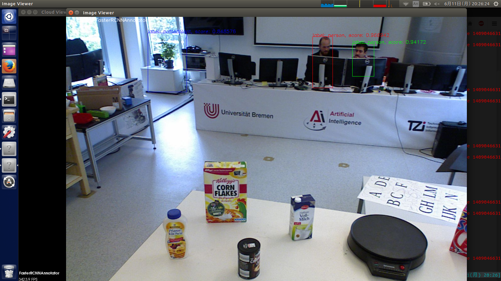
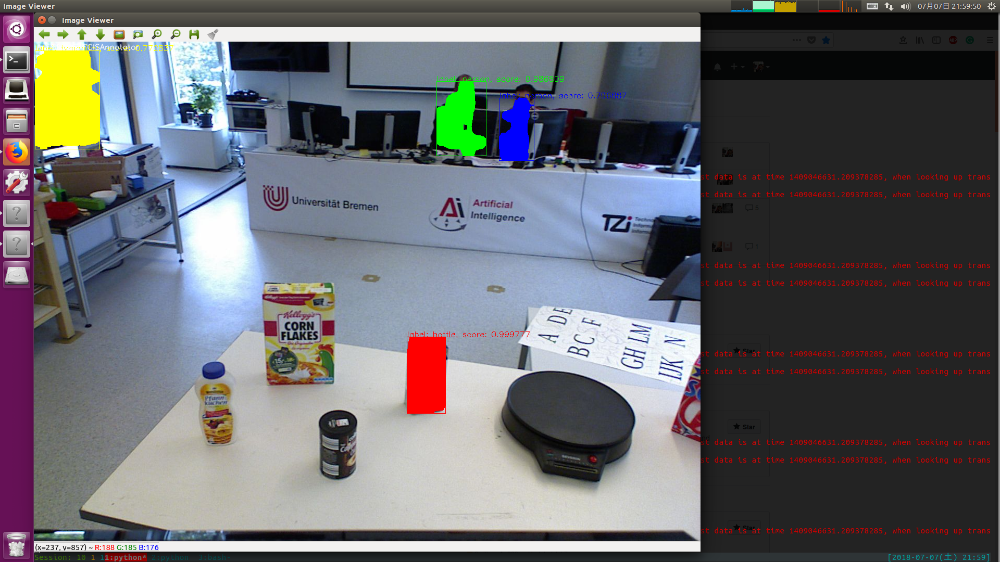

.. _gsoc_python_annotator:

==================================
Use Deep learning Python Annotator
==================================

This tutorial is based on Google Summer of Code(GSoC) 2018 program by Shingo Kitagawa.
The GSoC project and proposal page is `here <gsoc2018pythonannotar>`_.

The things below is done:

* Run Python code with boost:python and boost:numpy from C++ annotator.

* Implement Faster-RCNN Detection annotator with Python library Chainer.

* Implement SSD Detection annotator with Python library Chainer.

* Implement FCIS Instace Segmentation annotator with Python library Chainer.

* Implement Mask-RCNN Instace Segmentation annotator with Python library Chainer.

.. _gsoc2018pythonannotar: https://summerofcode.withgoogle.com/dashboard/project/4651529278062592/overview/

Requirement
-----------
* numpy
* boost::python
* `boost::numpy <https://github.com/ndarray/Boost.Numpy>`_
* `chainer <https://github.com/chainer/chainer>`_
* `chainercv <https://github.com/chainer/chainercv>`_
* `chainer-mask-rcnn <https://github.com/wkentaro/chainer-mask-rcnn>`_
* `rs_addons <https://github.com/bbferka/rs_addons>`_

Additional requirement for GPU
------------------------------

* CUDA
* `cupy <https://github.com/cupy/cupy>`_

Pull request
------------

For this feature, you need this PR: `bbferka/rs_addons <https://github.com/bbferka/rs_addons/pull/4>`_. 

Usage
-----

GPU usage
~~~~~~~~~

If you want to use GPU, you can specify GPU param as `1`.

Default value is set as `-1`, which means no GPU mode, in `descriptors/annotators/*.xml`.

Train model usage
~~~~~~~~~~~~~~~~~

For Faster-RCNN and SSD, pretrained model with `voc` is available.

For FCIS and Mask-RCNN, pretrained model with `sbd` and `coco` is available.

The default pretrained model is set as `coco` in `descriptors/annotators/*.xml`.

Annotation description
----------------------

All description is written in `descriptors/annotators/*.xml`.

Faster-RCNN
~~~~~~~~~~~

* structure (default: faster_rcnn_vgg16, choices: [faster_rcnn_vgg16])

  Network structure.

* pretrained_model (default: voc0712, choices: [voc0712, voc07])

  Pretrained model name.

* gpu (default: -1)

  GPU device number. `-1` is no GPU mode.

* score_thresh (default: 0.3, choice: [0.0-1.0])

  Score threshold for classification.

SSD
~~~

* structure (default: ssd300, choices: [ssd300, ssd512])

  Network structure.

* pretrained_model (default: voc0712, choices: [voc0712])

  Pretrained model name.

* gpu (default: -1)

  GPU device number. `-1` is no GPU mode.

* score_thresh (default: 0.3, choice: [0.0-1.0])

  Score threshold for classification.

FCIS
~~~~

* structure (default: fcis_resnet101, choices: [fcis_resnet101])

  Network structure.

* pretrained_model (default: coco, choices: [coco, sbd])

  Pretrained model name.

* gpu (default: -1)

  GPU device number. `-1` is no GPU mode.

* score_thresh (default: 0.3, choice: [0.0-1.0])

  Score threshold for classification.

Mask-RCNN
~~~~~~~~~

* structure (default: mask_rcnn_resnet50, choices: [mask_rcnn_resnet50])

  Network structure.

* pretrained_model (default: coco, choices: [coco, sbd])

  Pretrained model name.

* gpu (default: -1)

  GPU device number. `-1` is no GPU mode.

* score_thresh (default: 0.3, choice: [0.0-1.0])

  Score threshold for classification.

Annotator configuration
-----------------------

Available annotator configuration is as below:

* Faster-RCNN

  + Faster RCNN + VGG16 + voc07

  + Faster RCNN + VGG16 + voc0712

* SSD

  + SSD300 + voc0712
  
  + SSD300 + voc0712

* FCIS

  + FCIS + ResNet101 + sbd

  + FCIS + ResNet101 + coco

* Mask-RCNN 

  + Mask-RCNN + ResNet50 + sbd

  + Mask-RCNN + ResNet50 + coco

How to build rs_addons
----------------------

.. code-block:: bash

   mkdir catkin_ws/src -p
   cd catkin_ws/src
   git clone https://github.com/RoboSherlock/robosherlock.git
   git clone https://github.com/RoboSherlock/robosherlock_msgs.git
   git clone https://github.com/RoboSherlock/uimacpp_ros.git
   git clone https://github.com/bbferka/rs_addons.git
   git clone https://github.com/knowrob/knowrob.git
   git clone https://github.com/code-iai/iai_common_msgs.git
   cd ../
   rosdep install --ignore-src --from-path src -y -r -i
   catkin b

How to run demo
---------------

Faster-RCNN
~~~~~~~~~~~

.. code-block:: bash

   roslaunch robosherlock rs.launch ae:=faster_rcnn_test
   rosbag play --loop --clock test.bag

SSD
~~~

.. code-block:: bash

   roslaunch robosherlock rs.launch ae:=ssd_test
   rosbag play --loop --clock test.bag

FCIS
~~~~

.. code-block:: bash

   roslaunch robosherlock rs.launch ae:=fcis_test
   rosbag play --loop --clock test.bag

Mask-RCNN
~~~~~~~~~

.. code-block:: bash

   roslaunch robosherlock rs.launch ae:=mask_rcnn_test
   rosbag play --loop --clock test.bag
